# Mounting

For the first few years of production, it seems as though Ram offered two styles of center console faceplates in the fifth generation 1500, one with the USB ports and Aux In off to the right to allow a CD player or a storage pocket on the left, and one with those ports centered, shown here: 

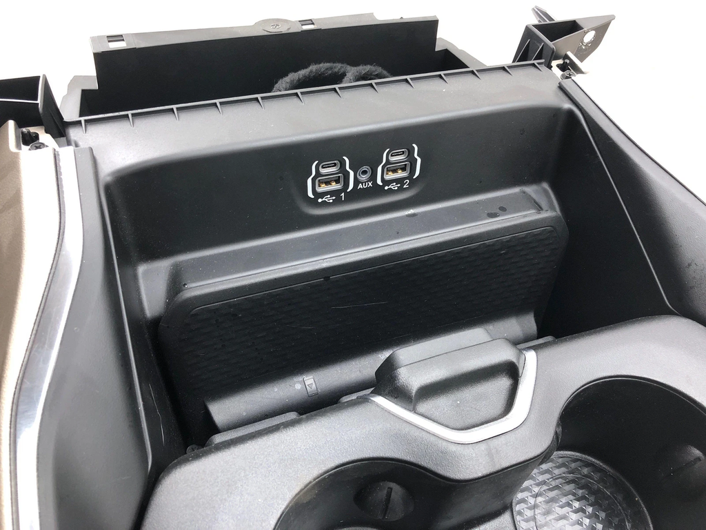

Some trucks came equipped with the optional wireless phone charger, and it also seems as though the wireless charger faceplates were only made with the USB and Aux In ports off to the right side, shown here:

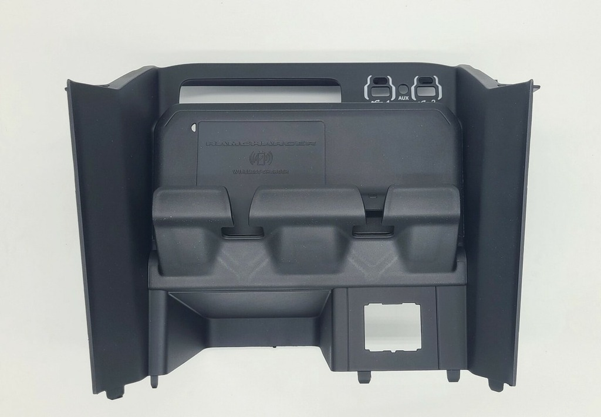

To retain the wireless charger but center the USB and Aux In ports, to install the seat button modules symmetrically, the relevant part of the faceplate must be scavenged from a center console faceplate with centered ports, and then installed on a faceplate with the wireless charger.

Start by cutting the relevant part out of the donor faceplate and smoothing out the cut edges to get something like the following:

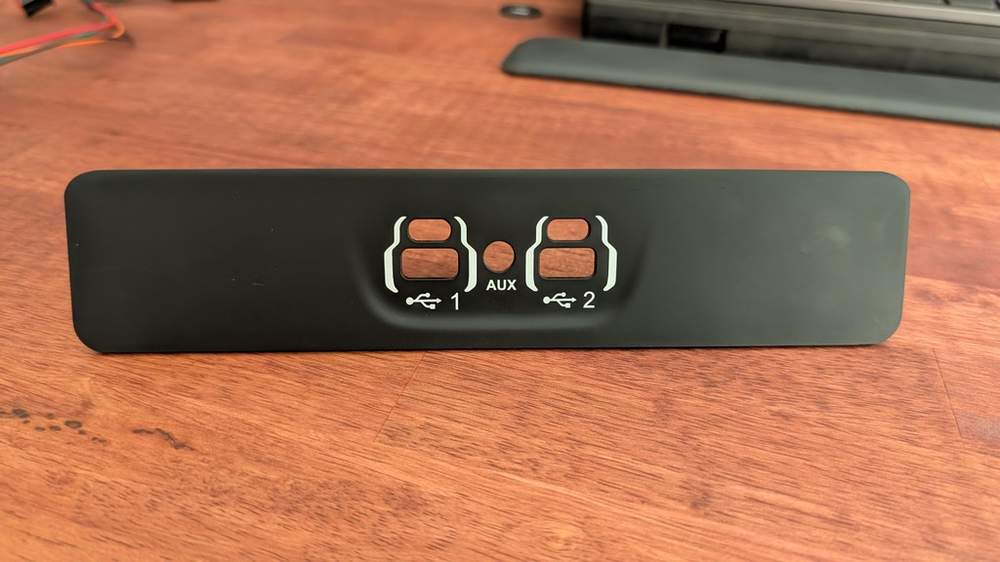

To simplify the project, the buttons used are the buttons from the same vehicle, but only used for the rear seats, shown here:

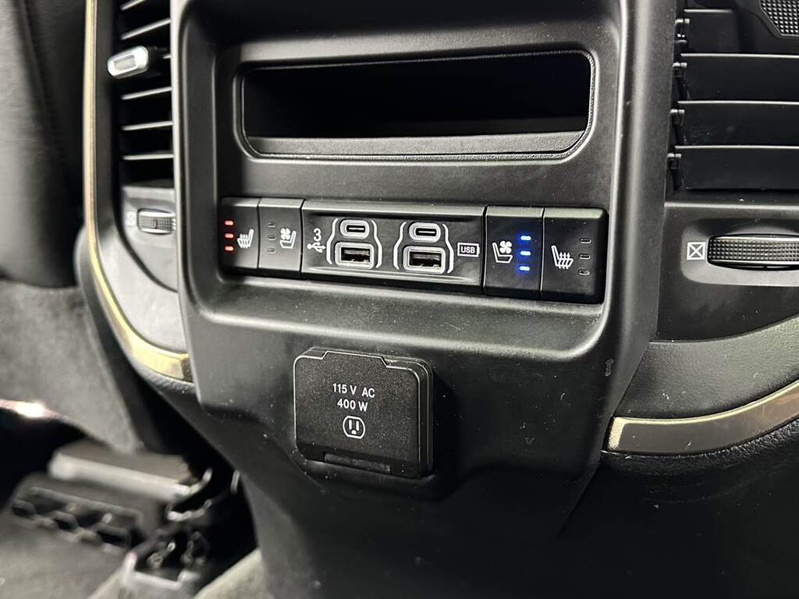

Note that the USB ports at the rear of the center console do not use the same module as the ones at the front of the center console, so transplanting the assembly of buttons and ports from the rear to the front is not easily done.

The mounting flanges on the button modules are at the top and bottom, and extend too far to be installed on either side of the ports in the center console faceplate. The rears of the button modules and the mounting flanges are shown here:

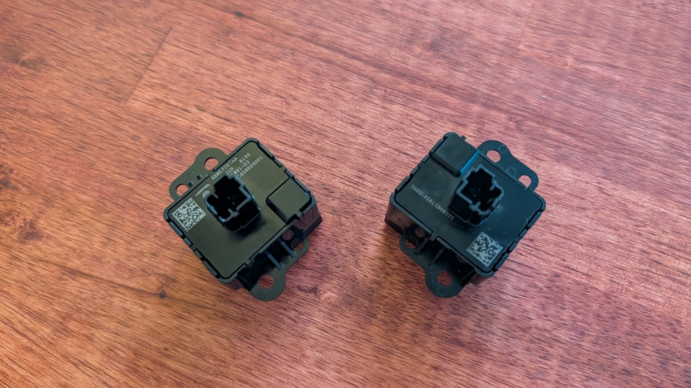

The mounting flanges need to be completely removed, and [**these mounting flanges**](https://cad.onshape.com/documents/5132d3ba81357ba5c9de6664/w/01ddbd30e18f7d29c6d44511/e/b6893859f852cbca466a3d6f?renderMode=0&uiState=6918f32293e2915b6cd9273d) bonded in their place, shown here:

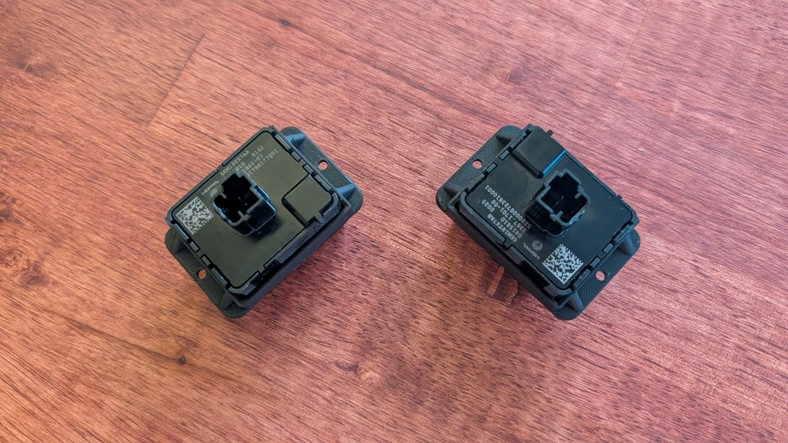

Remove appropriately sized and located sections of the scavenged panel where the button modules will reside, to get something like the following:

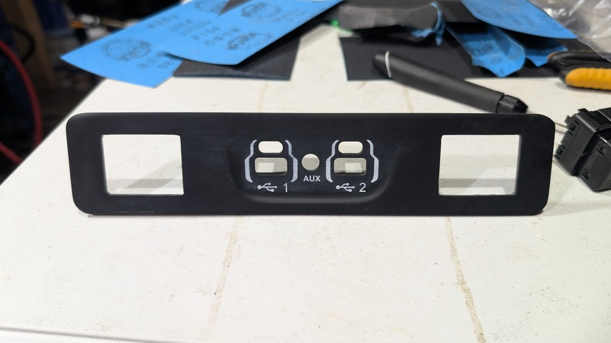

Bond [**these mounting bases**](https://cad.onshape.com/documents/5132d3ba81357ba5c9de6664/w/01ddbd30e18f7d29c6d44511/e/731e55fb501fd2d6602089eb?renderMode=0&uiState=6918f45793e2915b6cd92a2c) to the back of panel, aligned with the new openings, to get something like the following:

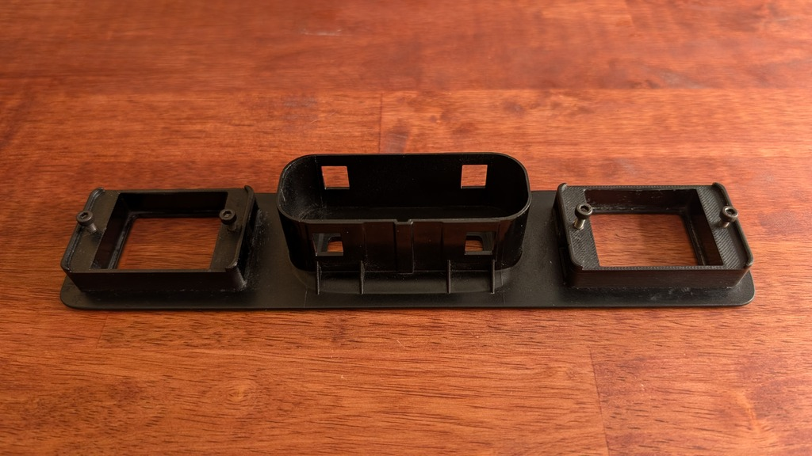

Test fitting the modified button modules into the modified panel, securing them with M3x0.5 bolts with 10mm shanks, should look something like the following:

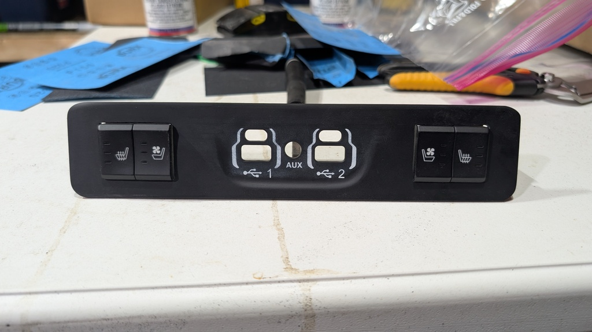

Optionally, the panel can be painted. A complete panel, with button modules and USB / Aux In connection module, should look something like the following:

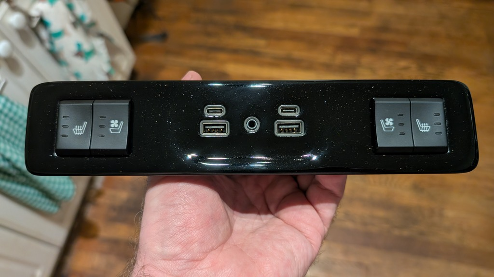

Portions of the existing faceplate, where the button modules and mounts as well as the USB / Aux In connection module and mount extend backwards, will need to be removed. The unmodified faceplate is shown here:

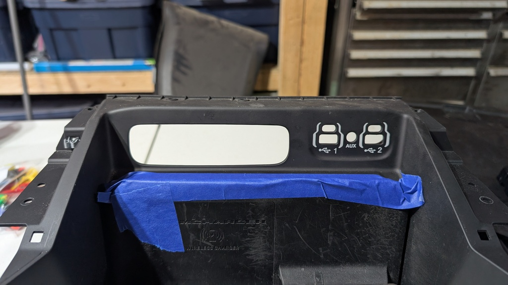

The faceplate with the new panel bonded in place is shown here:

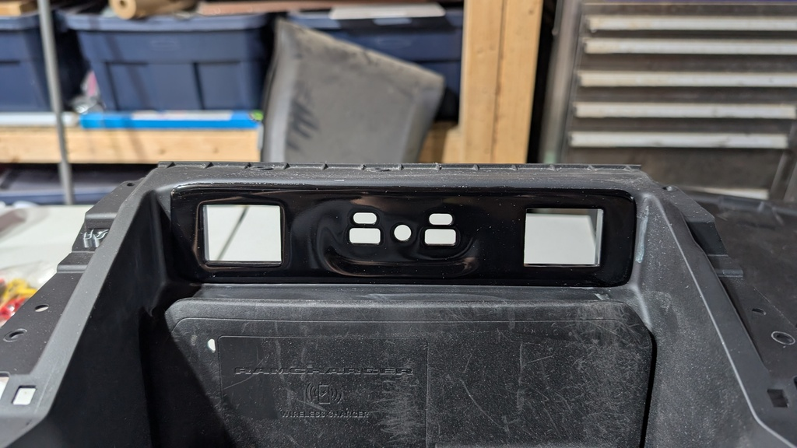

With the center console reassembled and installed, the faceplate looks like this:

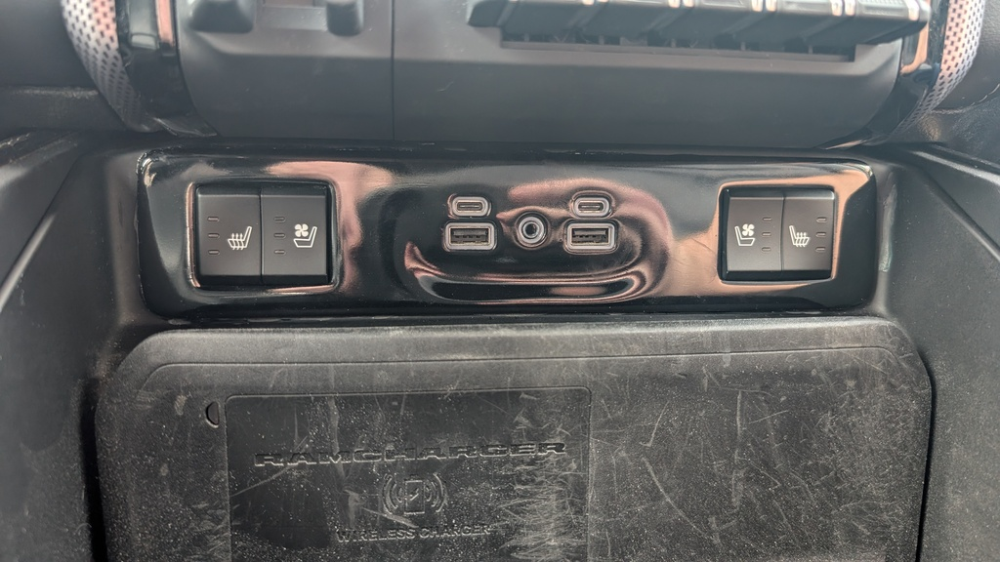

The board secures to the enclosure body with four M2 bolts and the enclosure lid simply snaps into place:

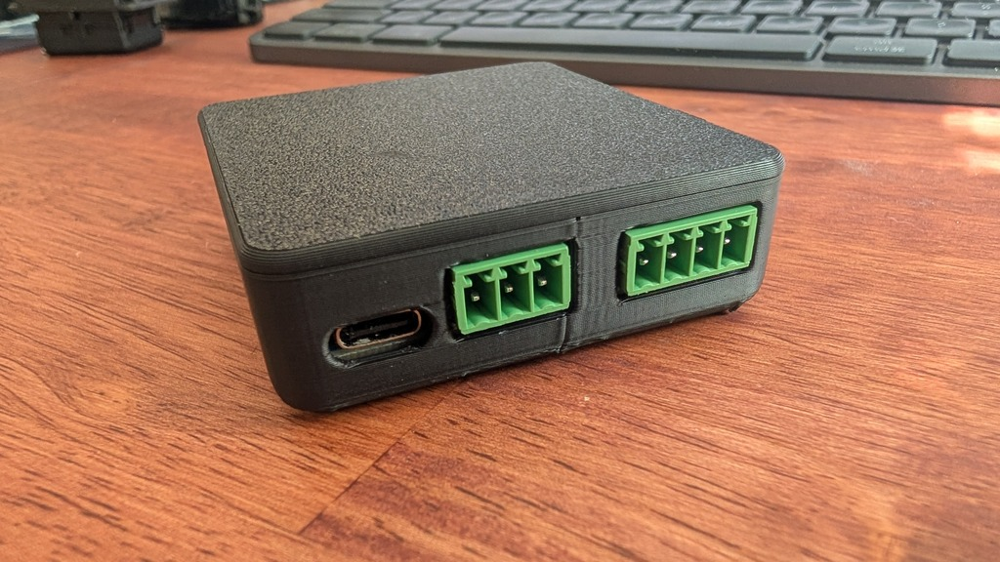

The board enclosure resides behind the touchscreen and can be secured in place with some 3M VHB tape. The wires easily route to this location:

