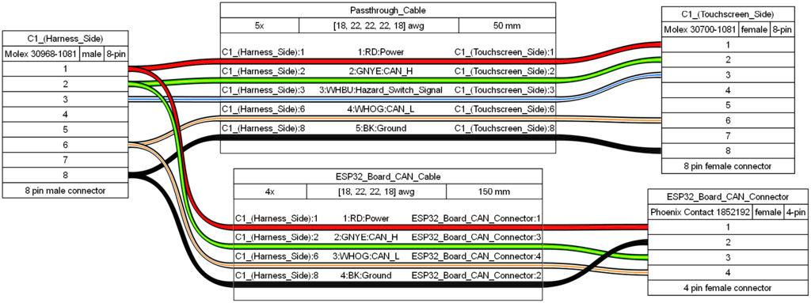
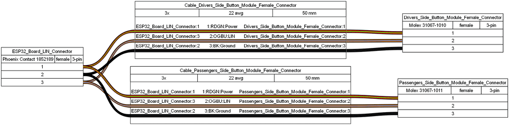
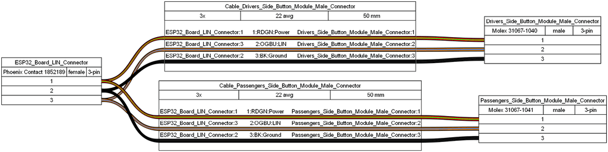
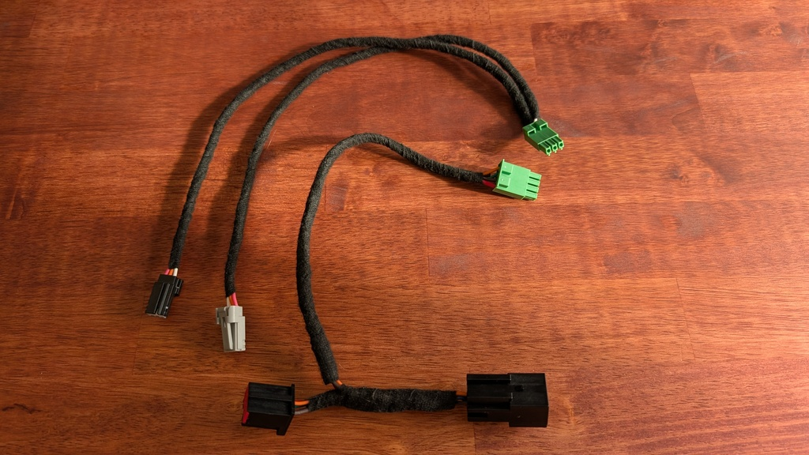
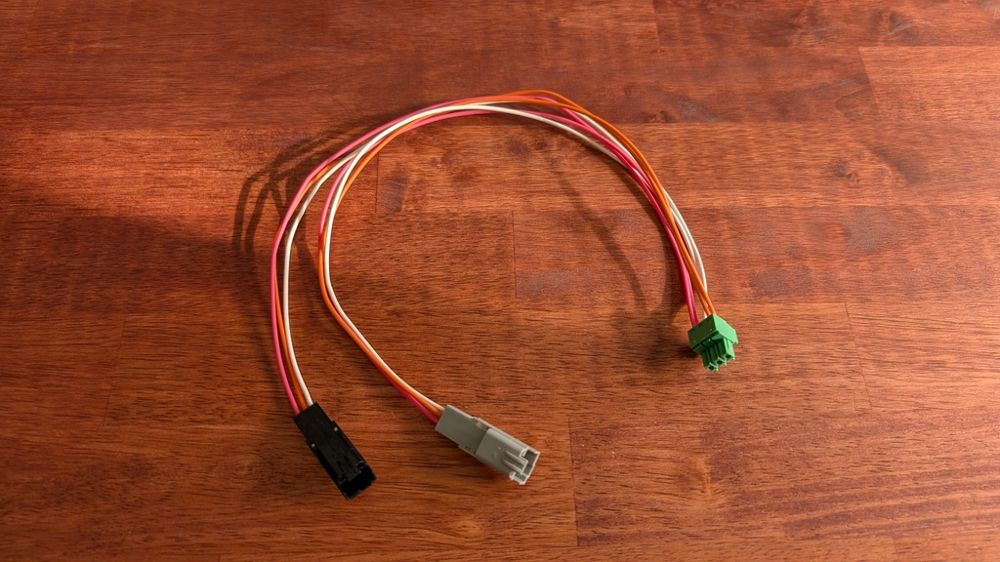

# Wiring

## Wiring Connectors

For connection to the live LIN bus for the rear seat button modules, for sniffing the messages on that bus, you'll need the following:
- **3 Position, Polarity 1 Male Connector** [Molex 31067-1040](https://www.mouser.com/ProductDetail/Molex/31067-1040?qs=xXuHO2M8EsclmCQulvk9WA%3D%3D)
- **3 Position, Polarity 2 Male Connector** [Molex 31067-1041](https://www.mouser.com/ProductDetail/Molex/31067-1041?qs=xXuHO2M8EsfvEFv0zBYqow%3D%3D)
- **Terminals** [TE Connectivity 2-1419158-5](https://www.mouser.com/ProductDetail/TE-Connectivity/2-1419158-5-Loose-Piece?qs=u4fy%2FsgLU9NhJSVCnvHvVg%3D%3D)

For connection to the button modules, creating a dedicated LIN bus, you'll need the following:
- **3 Position, Polarity 1 Female Connector** [Molex 31067-1010](https://www.mouser.com/ProductDetail/Molex/31067-1010?qs=EgZ34ONzqwiI93Itp3Z3Cw%3D%3D)
- **3 Position, Polarity 2 Female Connector** [Molex 31067-1011](https://www.mouser.com/ProductDetail/Molex/31067-1011?qs=ZlMU7IUseCuRPAqIYOdjIQ%3D%3D)
- **Terminals** [TE Connectivity V23540X7000Y21](https://www.mouser.com/ProductDetail/TE-Connectivity-AMP/V23540X7000Y21?qs=peXeY4GhCmiuuil8Xy1TIA%3D%3D)

For connection to the CAN bus and power, via the touchscreen connector C1, you'll need the following:
- **8 Position, Polarity 2 Male Connector** [Molex 30968-1081](https://www.mouser.com/ProductDetail/Molex/30968-1081?qs=ZlMU7IUseCtktvIsC3X4GQ%3D%3D)
    - **Terminals** [TE Connectivity 2-1419158-5 (Same as 3 position male connector terminals above)](https://www.mouser.com/ProductDetail/TE-Connectivity/2-1419158-5-Loose-Piece?qs=u4fy%2FsgLU9NhJSVCnvHvVg%3D%3D)
- **8 Position, Polarity 2 Female Connector** [Molex 30700-1081](https://www.mouser.com/ProductDetail/Molex/30700-1081?qs=7N95L5RsqFl8cTPEPHkrbA%3D%3D)
    - **Terminals** [TE Connectivity V23540X7000Y21 (Same as 3 position female connector terminals above)](https://www.mouser.com/ProductDetail/TE-Connectivity-AMP/V23540X7000Y21?qs=peXeY4GhCmiuuil8Xy1TIA%3D%3D)

## Wiring Diagrams

For connection to the CAN bus and power, the harness is as follows:

For connection to the dedicated LIN bus, directly to the button modules, the harness is as follows:

For connection to the live LIN bus for the rear seat button modules, the harness is as follows:

## Wiring Harnesses

The permanent wiring harnesses for both CAN and LIN are shown below, including the addition of TESA tape.

The wiring harness made for sniffing the LIN bus is shown below. Note that the black and grey connectors on the sniffing harness have male terminals, differentiating this harness from the permanent LIN harness, to easily connect in place of the existing seat button modules.

